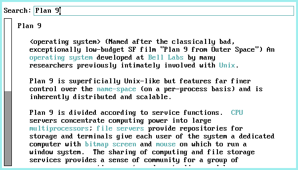

# vdict
A visual DICT client for plan9



Enter the word you want to search in the entry and press `Enter`.  
Coloured words are links that can be clicked to jump to their definition.

## Usage 
```sh
% mk install
% vdict -h <host> [-p <port>]
```
You can use `dict.org` for instance.

## License
MIT

## Bugs
You tell me!

